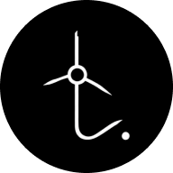
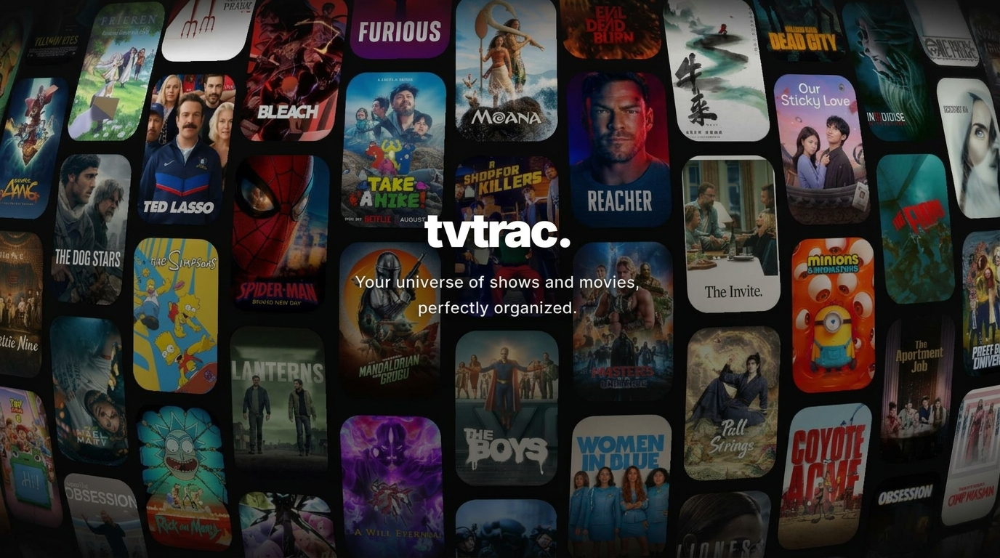

<div align="center">
  
  <h1>TVTrac</h1>
  <p>Track your favorite TV shows and movies with ease.</p>
</div>

---

<div align="center">
  
</div>

## 📖 Overview

TVTrac is a modern Next.js application designed to help you keep track of your TV shows and movies. Discover new content, organize your watchlist, and stay up to date with your favorite titles.

## ✨ Features

- 🎥 **Discover** trending movies and TV shows
- 📚 **Manage** your personal watchlist and collections
- 📱 **Responsive** design for mobile and desktop
- 🚀 Built with **Next.js 15+** and **React 19**
- 🎨 Styled with **Tailwind CSS**
- 🔒 Authentication and state management (Redux, React Query)
- 🖥️ **PWA Support** with Serwist

## 🛠️ Tech Stack

- **Framework**: [Next.js](https://nextjs.org/)
- **Styling**: [Tailwind CSS](https://tailwindcss.com/)
- **State Management**: [Redux Toolkit](https://redux-toolkit.js.org/), [React Query](https://tanstack.com/query/latest)
- **UI Interactions**: Framer Motion, dnd-kit

##  Getting Started

First, install the dependencies:

```bash
npm install
```

Then, run the development server:

```bash
npm run dev
```

Open [http://localhost:3000](http://localhost:3000) with your browser to see the application running locally.

## 📁 Project Structure

- `src/app`: Next.js App Router pages and layouts
- `src/components`: Reusable UI components
- `src/store`: Redux store configuration
- `public`: Static assets (images, manifests, icons)

## 📄 License

This project is licensed under the MIT License.
